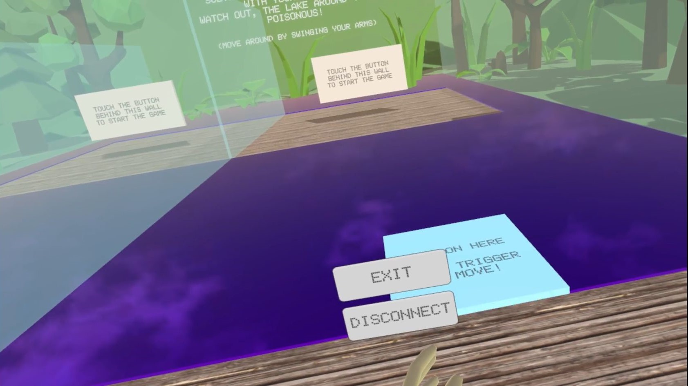
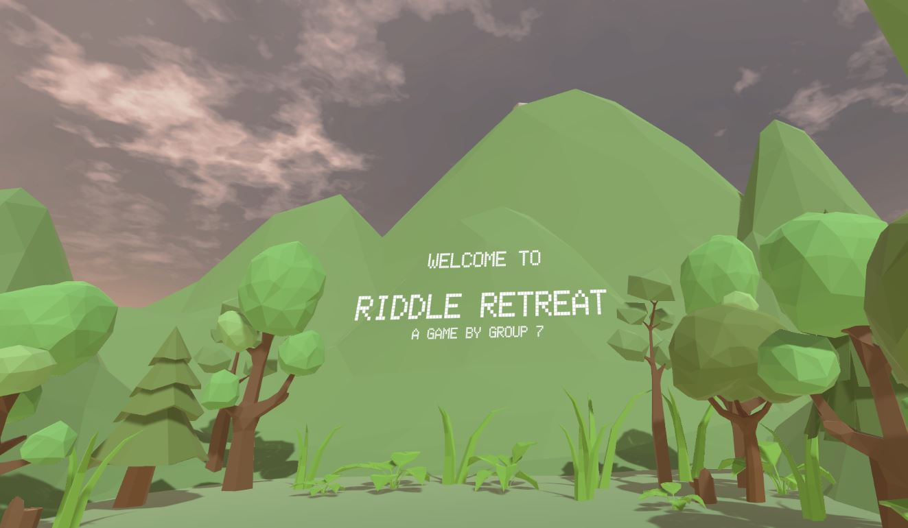
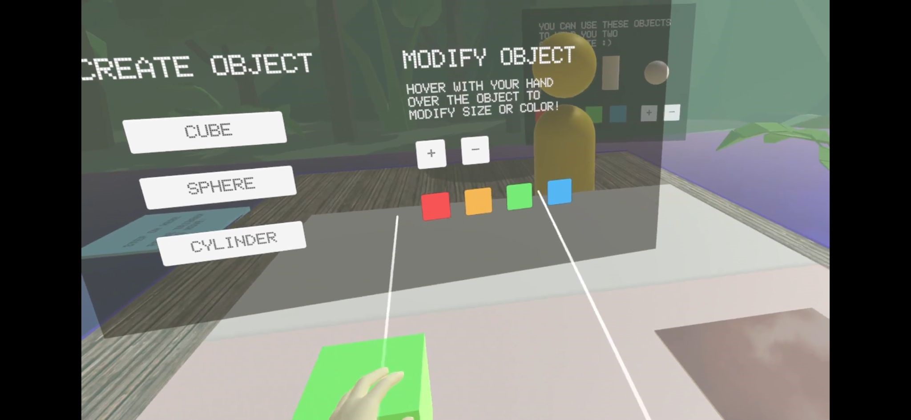

# Riddle Retreat

**Creators:** Renate Zhang, Tobias Christoph \
**Course:** Virtual Reality Exercise 2023WS, TU Vienna

## Project Overview

*Riddle Retreat* is a collaborative virtual reality puzzle-solving game where two players must communicate and work together to solve tasks and overcome challenges. Set on islands surrounded by a poisonous lake, players must navigate, create, and modify objects to reunite and celebrate their victory. Players must collaborate to solve tasks, following on-screen instructions and using various interaction mechanics, to be reunited on the winner's platform.

   
   
   

**Genre:** Collaborative 2-Player Puzzle-Solving VR Game  \
**Platform:** Unity (Compatible with Vive and Quest VR)  

### Tasks
1. **Navigation Task**:  
   Players use a "magic carpet" platform to traverse the poisonous lake safely and press ready buttons simultaneously to start the game.
2. **Object Creation Task**:  
   One player receives instructions while the other uses a UI to create and modify objects. Communication is essential to complete this task.

3. **Final Task**:  
   Once tasks are completed, players teleport to the winner's platform to celebrate.

## Features

- **Collaborative Multiplayer**:  
  Two-player interaction with simultaneous actions and teamwork.
  
- **Magic Carpet Locomotion**:  
  A helper platform enables safe navigation over hazardous terrain.

- **Object Creation and Modification**:  
  Players create and modify three different objects using an interactive UI.

- **Teleportation**:  
  Players teleport to the winner's platform upon task completion.

- **Haptics**:  
  Vibration feedback during key interactions like task completion and button pressing.

### Bonus Features

1. **Simultaneous Collaboration**: Players must perform actions simultaneously, such as pressing start buttons.
2. **Enhanced Haptics**: Vibration feedback for specific actions like starting the game or completing tasks.
3. **Teleportation**: Players can teleport to the final platform for the endgame celebration.

## Technical Details

- **Engine**: Unity (Version 2021.3.31f1 LTS)
- **Networked Gameplay**: Multiplayer interactions synchronized across players.
- **Environment**: Poisonous lake, floating islands, and realistic vegetation (assets used for visuals only).
- **UI and Interaction**:  
  - Buttons for starting and interacting with tasks.
  - Real-time updates and synchronization for smooth gameplay.

## Project Structure

- **Scenes**: `Assets/Scenes`
- **Scripts**: `Assets/Scripts`
- **Prefabs**: `Assets/Resources/Prefabs`
- **Models**: `Assets/Resources/Models`
- **Materials**: `Assets/Resources/Materials`

